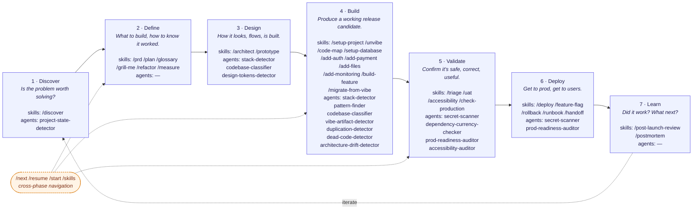
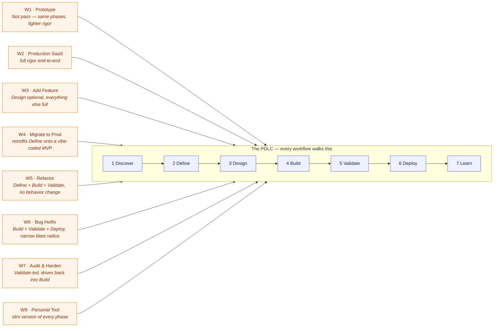

# The Big Picture — Everything, Through the PDLC

Every artifact in this library — agent, skill, workflow — earns its place by serving a phase of the **Product Development Lifecycle**.

```text
1 Discover  →  2 Define  →  3 Design  →  4 Build  →  5 Validate  →  6 Deploy  →  7 Learn  ↺
```

If you only read one file, this is it. The pieces are:

- **PDLC** (7 phases) — the spine. Everything else is positioned against it.
- **Skills** (28) — slash-commands the user runs *inside* a phase.
- **Agents** (12) — read-only diagnostics that skills delegate to *during* their phase.
- **Workflows** (8) — opinionated paths *through* the phases at different rigor levels.

Source-of-truth docs: [PDLC_Phases.md](PDLC_Phases.md) · [AGENTS.md](AGENTS.md) · [WORKFLOWS.md](WORKFLOWS.md) · [GAPS.md](GAPS.md)

---

## Table of contents

- [The PDLC at a glance](#the-pdlc-at-a-glance)
- [Phase by phase — what runs, what comes out](#phase-by-phase--what-runs-what-comes-out)
- [Workflows are PDLC traversals](#workflows-are-pdlc-traversals)
- [Workflow → Skill heatmap](#workflow--skill-heatmap)
- [Skill → Agent matrix](#skill--agent-matrix)
- [Reading guide](#reading-guide)

---

## The PDLC at a glance

The 7 phases, one-line goal per phase, and which skills + agents live there. Every workflow walks this same path; they differ only in rigor and emphasis.



`/next`, `/resume`, `/start`, and `/skills` are cross-phase navigation tools — run them at any point to orient, resume, or discover what's available. `project-state-detector` powers all of them.

---

## Phase by phase — what runs, what comes out

A two-line description per phase, the skills available, the agents they pull in, and the artifact you should leave with.

### 1 · Discover — *is this worth solving?*

Surface the real problem before structuring it. `/discover` walks through 5 steps across sessions — frame → customer → problem → stakes → bridge — and produces `.claude/discovery-notes.md` for `/prd` to consume.

| Item | Detail |
|---|---|
| Skills | `/discover` (optional — skip if problem is confirmed) |
| Agents | `project-state-detector` (for routing) |
| Output | `.claude/discovery-notes.md` |

### 2 · Define — *what to build & how to know it worked*

Synthesize the problem into a writeable scope: PRD, success metrics, plan, vocabulary. Pressure-test the plan before you spend a sprint on it.

| Item | Detail |
|---|---|
| Skills | `/prd` · `/plan` · `/measure` · `/glossary` · `/grill-me` · `/refactor` |
| Agents | *(none — these skills work in conversation + the codebase)* |
| Output | `.claude/prd.md` · `.claude/plan.md` · `.claude/measurement.md` · `.claude/glossary.md` · `.claude/refactor-plan.md` |

### 3 · Design — *how it looks, flows, and is built*

Make architecture and UI decisions explicit before building. `/architect` produces the architecture doc; `/prototype` produces three clickable UI variants.

| Item | Detail |
|---|---|
| Skills | `/architect` (step-decomposed, 5 checkpoints) · `/prototype` (three clickable HTML variants — pick one) |
| Agents | `stack-detector` · `codebase-classifier` · `design-tokens-detector` (for `/prototype` to respect existing tokens) |
| Output | `.claude/architecture.md` · `.claude/decisions.md` · `prototypes/variant-A.html` · `variant-B.html` · `variant-C.html` |

### 4 · Build — *produce a release candidate*

Where most of the library lives. Scaffold, wire third-party services, ship features in TDD layers. Every implementer skill calls `stack-detector` and `pattern-finder` so new code matches local style.

| Item | Detail |
|---|---|
| Skills | `/setup-project` · `/unvibe` · `/code-map` · `/setup-database` · `/add-auth` · `/add-payment` · `/add-files` · `/add-monitoring` · `/build-feature` · `/migrate-from-vibe` |
| Agents | `stack-detector` · `pattern-finder` · `codebase-classifier` · `vibe-artifact-detector` · `duplication-detector` · `dead-code-detector` · `architecture-drift-detector` (the last four are the rehabilitation detector set for `/unvibe`) |
| Output | Working code in coherent waves, one commit per layer, tests at each layer; for `/unvibe`: `.claude/unvibe-plan.md` + a series of commits across Clean / Consolidate / Converge / Harden waves |

### 5 · Validate — *safe, correct, useful*

Catch what shouldn't ship. `/check-production` orchestrates all validating agents in parallel; `/triage` turns findings into structured bug reports; `/uat` runs structured user acceptance testing; `/accessibility` checks WCAG 2.1 AA compliance.

| Item | Detail |
|---|---|
| Skills | `/triage` · `/uat` · `/accessibility` · `/check-production` |
| Agents | `secret-scanner` · `dependency-currency-checker` · `prod-readiness-auditor` · `accessibility-auditor` (+ `stack-detector` and `codebase-classifier` for context) |
| Output | Severity-graded readiness report · `.claude/bugs/<name>.md` · `.claude/uat-<feature>-<date>.md` |

### 6 · Deploy — *get to prod, get to users*

Code in production, feature visible to users, operations ready for handoff. Includes rollback planning, runbooks, feature flags for staged rollout, and stakeholder handoff docs.

| Item | Detail |
|---|---|
| Skills | `/deploy` · `/feature-flag` · `/rollback` · `/runbook` · `/handoff` |
| Agents | `secret-scanner` (pre-flight gate) · `prod-readiness-auditor` (if not already run) |
| Output | Deployed app, env vars, custom domain + SSL, post-deploy smoke tests, runbook · `.claude/handoff-<name>.md` |

### 7 · Learn — *did it work?*

Compare against Define's success metrics. Decide: double down, iterate, sunset. Feed insights back into Discover.

| Item | Detail |
|---|---|
| Skills | `/post-launch-review` · `/postmortem` |
| Agents | *(none)* |
| Output | `.claude/post-launch-review-<date>.md` · `.claude/postmortem-<date>-<slug>.md` |

---

## Workflows are PDLC traversals

The eight workflows are not eight different lifecycles. **They all walk the same seven phases.** They differ in *which phases they spend time in* and *how heavyweight* the work is at each step.



**Workflow × phase emphasis** — **●** = real work happens here. **○** = light pass. Blank = skipped.

| Workflow | 1 Discover | 2 Define | 3 Design | 4 Build | 5 Validate | 6 Deploy | 7 Learn |
|---|:-:|:-:|:-:|:-:|:-:|:-:|:-:|
| W1 · Prototype | ○ | ● | ● | | ○ | ○ | ○ |
| W2 · Production SaaS | ○ | ● | ● | ● | ● | ● | ○ |
| W3 · Add Feature | | ● | ○ | ● | ● | ● | ○ |
| W4 · Migrate to Prod | | ● | | ● | ● | ● | ○ |
| W5 · Refactor | | ● | | ● | ● | ○ | |
| W6 · Bug Hotfix | | | | ● | ● | ● | |
| W7 · Audit & Harden | | | | ● | ● | ● | ○ |
| W8 · Personal Tool | ○ | ○ | ○ | ● | ○ | ● | |

> Discover and Learn are mostly outside the library today. The dots are about *whether you should think about the phase*, not whether a skill runs.

---

## Workflow → Skill heatmap

Same data as [WORKFLOWS.md § heatmap](WORKFLOWS.md#workflow--skills-heatmap), kept here so this page is self-contained. **●** = always used. **○** = conditional.

| Skill | W1 Prototype | W2 SaaS | W3 Feature | W4 Migrate | W5 Refactor | W6 Hotfix | W7 Audit | W8 Personal |
|---|:-:|:-:|:-:|:-:|:-:|:-:|:-:|:-:|
| `/start` | ○ | ● | ○ | ○ | ○ | | | ○ |
| `/next` | | ● | ● | ● | ● | ○ | ● | ○ |
| `/resume` | ○ | ● | ● | ● | ● | ○ | ● | ○ |
| `/setup-project` | | ● | | | | | | ● |
| `/discover` | ○ | ● | ○ | | | | | |
| `/prd` | ○ | ● | ● | ○ | | | | ○ |
| `/plan` | ○ | ● | ● | ● | ● | | | ○ |
| `/measure` | | ● | ○ | | | | | |
| `/refactor` | | | ○ | | ● | ○ | ○ | |
| `/glossary` | ○ | ● | ○ | | | | | |
| `/grill-me` | ○ | ● | ○ | | ● | | | |
| `/architect` | | ● | ○ | | | | | |
| `/prototype` | ● | ● | ○ | | | | | ○ |
| `/code-map` | | | ● | ● | ● | ○ | | |
| `/setup-database` | | ● | ○ | ● | | | ○ | ● |
| `/add-auth` | | ● | ○ | ○ | | | ○ | ○ |
| `/add-payment` | | ● | ○ | ○ | | | ○ | |
| `/add-files` | | ● | ○ | ○ | | | ○ | ○ |
| `/add-monitoring` | | ● | ○ | ● | | | ● | |
| `/build-feature` | | ● | ● | ○ | ● | ● | ● | ● |
| `/migrate-from-vibe` | | | | ● | | | | |
| `/unvibe` | | ○ | | ● | ○ | | ○ | |
| `/triage` | | ● | ● | ● | ● | ● | ● | ○ |
| `/uat` | | ● | ● | ● | ○ | | ○ | |
| `/accessibility` | | ● | ○ | ● | | | ● | |
| `/check-production` | | ● | ● | ● | ● | ● | ● | ○ |
| `/feature-flag` | | ● | ● | ○ | | | | |
| `/rollback` | | ○ | ○ | ○ | | ● | | |
| `/runbook` | | ● | ○ | ● | | | | |
| `/deploy` | ○ | ● | ● | ● | ● | ● | ● | ● |
| `/handoff` | | ● | ○ | ○ | | | | |
| `/post-launch-review` | | ● | ○ | ● | | | | |
| `/postmortem` | | ○ | ○ | | | ○ | ○ | |

---

## Skill → Agent matrix

Which agents each skill delegates to. **●** = primary caller. **○** = ad-hoc / conditional.

| Skill ↓ \ Agent → | `stack-detector` | `codebase-classifier` | `pattern-finder` | `secret-scanner` | `dependency-currency-checker` | `prod-readiness-auditor` | `project-state-detector` | `design-tokens-detector` | `accessibility-auditor` | `vibe-artifact-detector` | `duplication-detector` | `dead-code-detector` | `architecture-drift-detector` |
|---|:-:|:-:|:-:|:-:|:-:|:-:|:-:|:-:|:-:|:-:|:-:|:-:|:-:|
| `/next` | | | | | ● | | ● | | | | | | |
| `/resume` | | | | | | | ● | | | | | | |
| `/skills` | | | | | | | ● | | | | | | |
| `/setup-project` | ● | | | | | | | | | | | | |
| `/architect` | ● | ● | | | | | | | | | | | |
| `/prototype` | | | | | | | | ● | | | | | |
| `/setup-database` | ● | | ● | | | | | | | | | | |
| `/add-auth` | ● | | ● | | | | | | | | | | |
| `/add-payment` | ● | | ● | | | | | | | | | | |
| `/add-files` | ● | | ● | | | | | | | | | | |
| `/build-feature` | ● | | ● | | | | | | | | | | |
| `/migrate-from-vibe` | ● | ● | ● | | | | | | | | | | |
| `/unvibe` | ● | ● | ● | ● | ● | | ● | | | ● | ● | ● | ● |
| `/triage` | ○ | | ○ | ○ | | | | | | | | | |
| `/accessibility` | | | | | | | | | ● | | | | |
| `/check-production` | ● | ● | | ● | ● | ● | | | | | | | |
| `/deploy` | | | | ● | | ● | | | | | | | |

Skills not listed (`/start`, `/discover`, `/prd`, `/plan`, `/measure`, `/refactor`, `/glossary`, `/grill-me`, `/code-map`, `/add-monitoring`, `/add-ai`, `/add-email`, `/setup-ci`, `/setup-tests`, `/uat`, `/feature-flag`, `/rollback`, `/runbook`, `/handoff`, `/post-launch-review`, `/postmortem`) call no agents — they work in conversation or with the codebase directly.

---

## Reading guide

| You want to… | Open |
|---|---|
| Understand the lifecycle deeply | [PDLC_Phases.md](PDLC_Phases.md) |
| Pick a workflow for what you're doing | [WORKFLOWS.md](WORKFLOWS.md) |
| Look up one specific skill or agent | [AGENTS.md](AGENTS.md) |
| See what's missing from the library | [GAPS.md](GAPS.md) |
| Read the locked greenfield stack | [skills/_stack-preferences.md](skills/_stack-preferences.md) |
| See the rules for adapting to existing codebases | [skills/_adaptation-playbook.md](skills/_adaptation-playbook.md) |
| Walk through a worked example | any [workflows/Wn-*.md](workflows/) page |

---

*This page is hand-curated against [PDLC_Phases.md](PDLC_Phases.md), [AGENTS.md](AGENTS.md), and the per-workflow files. When the lifecycle understanding shifts, this page changes first.*
