# The Big Picture — Workflows × Skills × Agents

One page. Three layers (workflows → skills → agents). Visual maps and cross-reference tables for every connection in this library.

If you only read one file in this repo, this is the one. Everything else is a deeper view of a slice shown here.

- **Layer 1 — Workflows** (8) — named end-to-end paths through the PDLC. *What you're trying to do.*
- **Layer 2 — Skills** (19) — slash-command workflows the user invokes. *What gets run.*
- **Layer 3 — Agents** (6) — read-only diagnostic helpers skills delegate to. *How context is gathered.*

Source-of-truth indexes: [AGENTS.md](AGENTS.md) · [WORKFLOWS.md](WORKFLOWS.md) · [GAPS.md](GAPS.md) · [PDLC_Phases.md](PDLC_Phases.md)

---

## Table of contents

- [The three-layer map](#the-three-layer-map)
- [PDLC × Skills × Agents](#pdlc--skills--agents)
- [Skill → Agent cross-reference](#skill--agent-cross-reference)
- [Workflow → Skill heatmap](#workflow--skill-heatmap)
- [Workflow → Agent heatmap](#workflow--agent-heatmap)
- [Skills, sorted by what they produce](#skills-sorted-by-what-they-produce)
- [Agents, sorted by structured output](#agents-sorted-by-structured-output)
- [Reading guide — pick your starting point](#reading-guide--pick-your-starting-point)

---

## The three-layer map

How a user request flows from a workflow choice → the skills it triggers → the agents those skills delegate to.

```mermaid
flowchart TB
    subgraph L1["Layer 1 · Workflows (intent)"]
        direction LR
        W1["W1 · Prototype"]
        W2["W2 · Production SaaS"]
        W3["W3 · Add Feature"]
        W4["W4 · Migrate to Prod"]
        W5["W5 · Refactor"]
        W6["W6 · Bug Hotfix"]
        W7["W7 · Audit & Harden"]
        W8["W8 · Personal Tool"]
    end

    subgraph L2["Layer 2 · Skills (slash-commands)"]
        direction TB
        subgraph S0["Stage 0 — Setup"]
            NS["/next-steps"]
            SP["/setup-project"]
        end
        subgraph S2["Stage 2 — Define"]
            PRD["/prd"]
            PLN["/plan"]
            RFC["/refactor"]
            GLS["/glossary"]
            GRL["/grill-me"]
        end
        subgraph S3["Stage 3 — Design"]
            PRT["/prototype"]
        end
        subgraph S4["Stage 4 — Build"]
            CM["/code-map"]
            DB["/setup-database"]
            AUTH["/add-auth"]
            PAY["/add-payment"]
            FS["/add-files"]
            MON["/add-monitoring"]
            BF["/build-feature"]
            MFV["/migrate-from-vibe"]
        end
        subgraph S5["Stage 5 — Validate"]
            TRG["/triage"]
            CHK["/check-production"]
        end
        subgraph S6["Stage 6 — Deploy"]
            DEP["/deploy"]
        end
    end

    subgraph L3["Layer 3 · Agents (read-only diagnostics)"]
        direction LR
        SD["stack-detector"]
        CC["codebase-classifier"]
        PF["pattern-finder"]
        SS["secret-scanner"]
        DCC["dependency-currency-checker"]
        PRA["prod-readiness-auditor"]
    end

    W1 --> PRT
    W2 --> SP & PRD & PLN & GLS & GRL & PRT & DB & AUTH & PAY & FS & MON & BF & CHK & DEP
    W3 --> NS & PRD & PLN & CM & BF & TRG & CHK & DEP
    W4 --> NS & PLN & CM & MFV & DB & MON & TRG & CHK & DEP
    W5 --> NS & PLN & RFC & GRL & CM & BF & TRG & CHK & DEP
    W6 --> TRG & BF & CHK & DEP
    W7 --> NS & MON & BF & TRG & CHK & DEP
    W8 --> SP & BF & DEP

    NS --> SD & CC & DCC
    SP --> SD
    DB --> SD & PF
    AUTH --> SD & PF
    PAY --> SD & PF
    FS --> SD & PF
    BF --> SD & PF
    MFV --> SD & CC & PF
    CHK --> SD & CC & SS & DCC & PRA
    DEP --> SS & PRA

    classDef workflow fill:#fff4e6,stroke:#d97706,color:#7c2d12;
    classDef skill fill:#eef2ff,stroke:#4f46e5,color:#1e1b4b;
    classDef agent fill:#ecfdf5,stroke:#059669,color:#064e3b;
    class W1,W2,W3,W4,W5,W6,W7,W8 workflow;
    class NS,SP,PRD,PLN,RFC,GLS,GRL,PRT,CM,DB,AUTH,PAY,FS,MON,BF,MFV,TRG,CHK,DEP skill;
    class SD,CC,PF,SS,DCC,PRA agent;
```

> Mermaid renders inline on GitHub. To experiment locally, paste into [mermaid.live](https://mermaid.live).

---

## PDLC × Skills × Agents

Each skill's lifecycle stage and the agents it delegates to. Stages map to [PDLC_Phases.md](PDLC_Phases.md).

| Stage | Skill | Slash-command | Agents called |
|---|---|---|---|
| 0 — Setup | `0-Always-Next-Steps` | `/next-steps` | `stack-detector` · `codebase-classifier` · `dependency-currency-checker` |
| 0 — Setup | `0-Setup-Project` | `/setup-project` | `stack-detector` |
| 2 — Define | `2-Define-PRD` | `/prd` | — |
| 2 — Define | `2-Define-Plan` | `/plan` | — |
| 2 — Define | `2-Define-Refactor` | `/refactor` | — |
| 2 — Define | `2-Define-Glossary` | `/glossary` | — |
| 2 — Define | `2-Define-Grill-Me` | `/grill-me` | — |
| 3 — Design | `3-Design-Prototype` | `/prototype` | — |
| 4 — Build | `4-Build-Code-Map` | `/code-map` | — |
| 4 — Build | `4-Build-Database` | `/setup-database` | `stack-detector` · `pattern-finder` |
| 4 — Build | `4-Build-Auth` | `/add-auth` | `stack-detector` · `pattern-finder` |
| 4 — Build | `4-Build-Payments` | `/add-payment` | `stack-detector` · `pattern-finder` |
| 4 — Build | `4-Build-File-Storage` | `/add-files` | `stack-detector` · `pattern-finder` |
| 4 — Build | `4-Build-Monitoring` | `/add-monitoring` | — |
| 4 — Build | `4-Build-Feature` | `/build-feature` | `stack-detector` · `pattern-finder` |
| 4 — Build | `4-Build-Migrate-From-Vibe` | `/migrate-from-vibe` | `stack-detector` · `codebase-classifier` · `pattern-finder` |
| 5 — Validate | `5-Validate-Triage` | `/triage` | `stack-detector` (ad-hoc) · `pattern-finder` (ad-hoc) |
| 5 — Validate | `5-Validate-Production-Readiness` | `/check-production` | **all six** — `stack-detector` · `codebase-classifier` · `secret-scanner` · `dependency-currency-checker` · `prod-readiness-auditor` |
| 6 — Deploy | `6-Deploy` | `/deploy` | `secret-scanner` (gate) · `prod-readiness-auditor` (if not already run) |

Note: PDLC Stage 1 (Discover) and Stage 7 (Learn) currently have **no skills** — see [GAPS.md](GAPS.md).

---

## Skill → Agent cross-reference

Inverse view: which skills each agent serves. **●** = primary caller. **○** = ad-hoc / conditional.

| Skill ↓ \ Agent → | `stack-detector` | `codebase-classifier` | `pattern-finder` | `secret-scanner` | `dependency-currency-checker` | `prod-readiness-auditor` |
|---|:-:|:-:|:-:|:-:|:-:|:-:|
| `/next-steps` | ● | ● | | | ● | |
| `/setup-project` | ● | | | | | |
| `/prd` | | | | | | |
| `/plan` | | | | | | |
| `/refactor` | | | | | | |
| `/glossary` | | | | | | |
| `/grill-me` | | | | | | |
| `/prototype` | | | | | | |
| `/code-map` | | | | | | |
| `/setup-database` | ● | | ● | | | |
| `/add-auth` | ● | | ● | | | |
| `/add-payment` | ● | | ● | | | |
| `/add-files` | ● | | ● | | | |
| `/add-monitoring` | | | | | | |
| `/build-feature` | ● | | ● | | | |
| `/migrate-from-vibe` | ● | ● | ● | | | |
| `/triage` | ○ | | ○ | ○ | | |
| `/check-production` | ● | ● | | ● | ● | ● |
| `/deploy` | | | | ● | | ● |

**Hot agents** — invoked across the most skills:
- `stack-detector` — 9 skills (entry-point read for almost everything)
- `pattern-finder` — 7 skills (every `/add-*` and `/build-feature`)
- `prod-readiness-auditor` — 2 skills (`/check-production`, `/deploy`) but heavyweight

**Cold agents** — focused, deliberate:
- `codebase-classifier` — only when behavior branches on greenfield/wired/vibe-coded
- `secret-scanner` — pre-deploy gate + production readiness only
- `dependency-currency-checker` — the only network-touching agent; reserved for `/next-steps` and `/check-production`

---

## Workflow → Skill heatmap

Mirror of [WORKFLOWS.md § heatmap](WORKFLOWS.md#workflow--skills-heatmap), kept here so this page is self-contained. **●** = always used. **○** = conditional.

| Skill | W1 Prototype | W2 SaaS | W3 Feature | W4 Migrate | W5 Refactor | W6 Hotfix | W7 Audit | W8 Personal |
|---|:-:|:-:|:-:|:-:|:-:|:-:|:-:|:-:|
| `/next-steps` | | ● | ● | ● | ● | ○ | ● | ○ |
| `/setup-project` | | ● | | | | | | ● |
| `/prd` | | ● | ● | ○ | | | | ○ |
| `/plan` | | ● | ● | ● | ● | | | ○ |
| `/refactor` | | | ○ | | ● | ○ | ○ | |
| `/glossary` | | ● | ○ | | | | | |
| `/grill-me` | | ● | ○ | | ● | | | |
| `/prototype` | ● | ● | ○ | | | | | ○ |
| `/code-map` | | | ● | ● | ● | ○ | | |
| `/setup-database` | | ● | ○ | ● | | | ○ | ● |
| `/add-auth` | | ● | ○ | ○ | | | ○ | ○ |
| `/add-payment` | | ● | ○ | ○ | | | ○ | |
| `/add-files` | | ● | ○ | ○ | | | ○ | ○ |
| `/add-monitoring` | | ● | ○ | ● | | | ● | |
| `/build-feature` | | ● | ● | ○ | ● | ● | ● | ● |
| `/migrate-from-vibe` | | | | ● | | | | |
| `/triage` | | ● | ● | ● | ● | ● | ● | ○ |
| `/check-production` | | ● | ● | ● | ● | ● | ● | ○ |
| `/deploy` | ○ | ● | ● | ● | ● | ● | ● | ● |

---

## Workflow → Agent heatmap

Same idea, projected to the agent layer (synthesized from each workflow's *Agents called* section). **●** = always fires. **○** = conditional. Blank = not used.

| Agent | W1 | W2 | W3 | W4 | W5 | W6 | W7 | W8 |
|---|:-:|:-:|:-:|:-:|:-:|:-:|:-:|:-:|
| `stack-detector` | | ● | ● | ● | ● | ○ | ● | ● |
| `codebase-classifier` | | ● | ○ | ● | ● | | ● | |
| `pattern-finder` | | ● | ● | ● | ● | ○ | ● | ● |
| `secret-scanner` | | ● | ● | ● | ○ | ○ | ● | ○ |
| `dependency-currency-checker` | | ● | ● | ● | ○ | | ● | |
| `prod-readiness-auditor` | | ● | ● | ● | ● | ● | ● | |

**W7 — Audit & Harden** is the agent-heaviest workflow (all six fire deliberately). **W1 — Prototype** is the lightest (zero — `/prototype` is self-contained).

---

## Skills, sorted by what they produce

When you know the artifact you want, find the skill that emits it.

| Skill | Output artifact |
|---|---|
| `/next-steps` | `.claude/next-steps.md` — living journey-to-production checklist |
| `/setup-project` | Scaffolded greenfield repo, `CLAUDE.md`, third-party accounts, git/GitHub conventions |
| `/prd` | `.claude/prd.md` — problem, personas, stories, requirements, metrics, risks |
| `/plan` | `.claude/plan.md` — vertical slices, TDD strategy, commit sequencing |
| `/refactor` | `.claude/refactor-plan.md` — tiny commits + Claude Code refactoring best practices |
| `/glossary` | `.claude/glossary.md` — domain term tables and relationships |
| `/grill-me` | Surfaced unknowns, decided trade-offs, sharper plan (in-conversation) |
| `/prototype` | `prototypes/variant-A.html`, `variant-B.html`, `variant-C.html` (Tailwind via CDN) |
| `/code-map` | Module map, public interfaces, data-flow narrative |
| `/setup-database` | Migrations applied + verified (Drizzle / Prisma / Kysely / raw SQL) |
| `/add-auth` | Wired auth (Firebase preferred; adapts to Clerk / NextAuth / Supabase / custom JWT) |
| `/add-payment` | Wired Stripe with webhook signature verification, idempotency, Customer Portal |
| `/add-files` | Wired Firebase Storage (or extends S3 / R2 / UploadThing), magic-byte MIME checks |
| `/add-monitoring` | Sentry + PostHog wired, env vars, verified with real test events |
| `/build-feature` | Feature in TDD layers — schema → storage → routes → hooks → components |
| `/migrate-from-vibe` | Working app extracted off Replit / V0 / Lovable / Bolt onto a real local stack |
| `/triage` | `.claude/bugs/<short-name>.md` — root-cause hypothesis, 2+ fixes, evidence |
| `/check-production` | Severity-graded readiness report (Critical/High/Medium/Low) with `file:line` |
| `/deploy` | Deployed app, env vars, custom domain + SSL, runbook, post-deploy smoke tests |

---

## Agents, sorted by structured output

Every agent returns a labeled block (best practice #7) so callers parse cleanly.

| Agent | Output block | Network access? |
|---|---|:-:|
| `stack-detector` | `STACK PROFILE` — framework, DB/ORM, auth, payments, AI, monitoring, deploy target | — |
| `codebase-classifier` | One-word verdict (`greenfield` / `wired` / `vibe-coded`) + confidence + adaptation hint | — |
| `pattern-finder` | `PATTERN` — location, naming, imports, validation, error handling, response shape, auth wiring | — |
| `secret-scanner` | `SECRET SCAN REPORT` — truncated evidence + rotation actions (working tree **and** git history) | — |
| `dependency-currency-checker` | `CURRENCY REPORT` — risk and effort estimates per stack-relevant dependency | ✅ `WebFetch` to npm |
| `prod-readiness-auditor` | Severity-graded findings (Critical/High/Medium/Low) with `file:line`, impact, fix | — |

---

## Reading guide — pick your starting point

| You want to… | Start here |
|---|---|
| Pick a workflow for what you're doing | [WORKFLOWS.md § choose a workflow](WORKFLOWS.md#how-to-choose-a-workflow) |
| Look up one specific skill or agent | [AGENTS.md](AGENTS.md) |
| See what's missing from the library | [GAPS.md](GAPS.md) |
| Understand the lifecycle | [PDLC_Phases.md](PDLC_Phases.md) |
| Read the user's locked greenfield stack | [skills/_stack-preferences.md](skills/_stack-preferences.md) |
| See the rules for adapting to existing codebases | [skills/_adaptation-playbook.md](skills/_adaptation-playbook.md) |
| Walk through a worked example | any [workflows/Wn-*.md](workflows/) page — every one has an *example walkthrough* section |

---

*This page is hand-curated against [AGENTS.md](AGENTS.md) and the per-workflow files in [workflows/](workflows/). When you add or change a skill, agent, or workflow, update those source-of-truth files and re-check the heatmaps here.*
