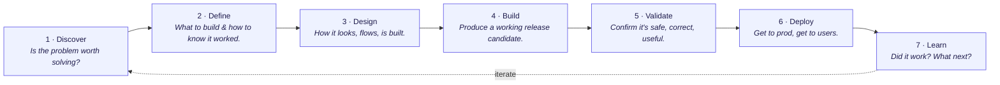

# Product Development Lifecycle

A seven-phase framework for taking a product from problem identification through launch and into ongoing measurement.

```text
Discover  →  Define  →  Design  →  Build  →  Validate  →  Deploy  →  Learn  ↺
```

## At a glance



| # | Phase | Goal | Library coverage |
|---|---|---|---|
| 1 | Discover | Decide if a problem is worth solving | *(human-led — no skills today)* |
| 2 | Define | Decide what to build and how you'll know it worked | `/prd` · `/plan` · `/glossary` · `/grill-me` · `/refactor` |
| 3 | Design | Decide how it looks, flows, and is built | `/prototype` |
| 4 | Build | Produce a working release candidate | `/setup-project` · `/code-map` · `/setup-database` · `/add-auth` · `/add-payment` · `/add-files` · `/add-monitoring` · `/build-feature` · `/migrate-from-vibe` |
| 5 | Validate | Confirm the RC is safe, correct, and useful | `/triage` · `/check-production` |
| 6 | Deploy | Get code to prod and the feature to users | `/deploy` |
| 7 | Learn | Find out if it worked and decide what's next | *(human-led — no skills today)* |

For a one-page big-picture map of how skills, agents, and workflows fit each phase, see [MAP.md](MAP.md).

---

## 1. Discover

> **Goal:** Decide whether a problem is worth solving.

> **Skill coverage:** Customer/product discovery is a human-led activity — interviews, market scan, sizing — that happens outside the code. The skill library intentionally has no Discover-phase commands today; this phase is reserved for that work and may grow skills later (e.g., a research-synthesis or interview-coding skill).

### Activities

- User research: interviews, surveys, support ticket mining, sales call review
- Market and competitive scan
- Opportunity sizing: TAM, addressable users, revenue or retention impact
- Problem framing: who hurts, how often, how much
- Hypothesis formation: *"we believe X for Y because Z"*
- Strategic fit check against company OKRs or roadmap themes
- Data audit: what data already exists about this problem; what would need to be instrumented to validate it quantitatively
- Data feasibility check: if the proposed feature depends on data you don't have or can't legally use, surface it now

### Outputs

- Opportunity brief
- Validated problem statement
- Rough sizing
- Data-availability note

### Exit Criteria

Problem is real, big enough, aligned with strategy, and the data needed to build and measure it is plausibly accessible.

---

## 2. Define

> **Goal:** Decide what to build and how you'll know it worked.

### Activities

- PRD: problem, proposed solution, scope, non-goals
- User stories with acceptance criteria
- Success metrics: leading and lagging, with target thresholds
- Constraints: legal, compliance, accessibility, performance budgets
- Dependencies: other teams, vendors, infra
- Definition of Done
- Risk register and mitigation
- Data contract: what data this feature reads, writes, or generates — schema, source, freshness, ownership
- Privacy and compliance scope: PII, sensitive categories, regional constraints (GDPR, CCPA, HIPAA)
- Measurement plan: every success metric maps to specific events with specific properties
- Data quality requirements: acceptable rate of missing or wrong data for the feature to work
- Training and eval data scope, if AI features are involved: source, ownership, legal usage rights

### Outputs

- PRD
- Prioritized backlog
- Success metrics doc
- Data contract
- Measurement plan

### Exit Criteria

Engineering can estimate it, QA can test it, PM can measure it, data team knows what's coming.

---

## 3. Design

> **Goal:** Decide how it looks, flows, and is built.

### Activities

- UX flows, wireframes, high-fidelity mockups, or working prototypes
- Prototype testing with real users
- Accessibility review
- Technical design doc: architecture, API contracts, deploy topology
- Feature flag strategy
- Security and privacy review for sensitive flows
- Data model design: schemas, relationships, indexes, retention
- Data flow diagrams for any feature touching multiple systems
- Telemetry plan: what gets logged, with what properties, at what sampling rate
- Observability for AI components, if relevant: input, output, model version, latency, cost — with storage and access decided
- Data dependencies surfaced explicitly to the data team before Build starts

> **Note on prototypes**
>
> Working code increasingly substitutes for or accompanies static mockups. Prototypes are hypotheses to test, not finished designs. The decisions — information architecture, interaction model, system coherence, schema choices — are still the work.

### Outputs

- Final designs or working prototypes
- Tech spec
- Data model and flow diagrams
- Telemetry plan
- Flag plan

### Exit Criteria

Eng knows what to build, PM knows what success looks like in data, data team has implemented or scheduled the required pipelines, ops knows how to support it.

---

## 4. Build

> **Goal:** Produce a working release candidate.

### Activities

- Sprint planning, ticket breakdown
- Feature branch development behind flags
- Code review on every PR
- CI runs continuously: lint, test, scan, build
- CD pushes to dev and staging on every merge
- Internal demos and stakeholder check-ins
- Documentation drafted in parallel: API docs, runbooks, support guides
- Telemetry implemented in the same PR as the feature, not deferred
- Data validation in code: schema enforcement, null handling, type checks at boundaries
- Data migrations treated as first-class work: versioned, reviewed, reversible

### Outputs

A release candidate in staging, behind a flag, with telemetry live, with docs.

### Exit Criteria

Acceptance criteria met, CI green, RC in staging, telemetry firing correctly into dev and staging dashboards.

---

## 5. Validate

> **Goal:** Confirm the RC is safe, correct, and useful before exposing users.

### Activities

- QA: regression, edge cases, exploratory
- UAT with internal users or design partners
- Performance and load testing against budgets set in Define
- Security testing: pen test, DAST, threat model review
- Accessibility audit
- Beta or dogfood release behind flag to small cohort
- Bug triage and fix cycles back into Build
- Telemetry validation: events firing correctly in staging with populated properties
- Data quality testing: nulls, edge cases, encoding, timezone bugs surfaced in beta data
- Dashboard pre-flight: the dashboards you'll watch in Deploy are built and verified now, not on launch day
- Privacy validation: PII handling matches spec, logs aren't leaking sensitive data, retention configured

### Outputs

- Signed-off RC
- Beta learnings
- Validated telemetry
- Working dashboards
- Known-issues list

### Exit Criteria

No P0/P1 bugs, performance/security/accessibility gates passed, telemetry verified end-to-end, beta signal positive or risks accepted explicitly.

---

## 6. Deploy

> **Goal:** Get code into production *and* make the feature available to users — these are two distinct steps.

### Activities

- Pre-deploy: rollout plan, rollback plan, comms plan, support training
- Deploy to production via canary, blue-green, or progressive rollout
- Release to users via feature flag with gradual percentage ramp
- GTM execution: marketing, docs published, sales enablement, in-app announcements
- Real-time monitoring of error rates, latency, business metrics
- Rollback or flag-off if SLO breach or unexpected user signal
- Live data quality monitoring during rollout: telemetry events landing at expected volume
- Cohort-level metric monitoring: rollout cohort vs. control
- Data freshness and latency in dashboards verified during the ramp
- Cost tracking for paid AI APIs or other usage-based dependencies, if relevant

### Outputs

- Feature live to target audience
- GTM motion executed
- Dashboards green

### Exit Criteria

Stable at 100% rollout (or intended cohort) for the agreed soak period, no active rollback conditions, data flowing correctly.

---

## 7. Learn

> **Goal:** Find out if it actually worked and decide what to do next.

### Activities

- Metric review against Define's success thresholds
- A/B test results, if applicable
- Qualitative feedback: support tickets, user interviews, NPS, sales feedback
- Post-launch retro: what worked, what didn't, process improvements
- Decision: double down, iterate, or sunset
- Insights fed back into Discover for the next cycle
- Internal docs and tribal knowledge updated
- Cohort and segment slicing of metrics to find non-obvious patterns
- Counterfactual framing: what would have happened without this feature
- Data debt review: instrumentation gaps this launch revealed, added to the data backlog
- Feedback-to-data loop: qualitative findings that suggest new events to instrument feed the next Define cycle
- For AI features: quality drift, cost per outcome, and user trust signals tracked over time, not just at launch

### Outputs

- Launch review doc
- Decision on next step
- Backlog updates
- Data backlog updates

### Exit Criteria

None — Learn is continuous until the feature is sunset or fundamentally rethought, at which point you're back in **Discover**.
