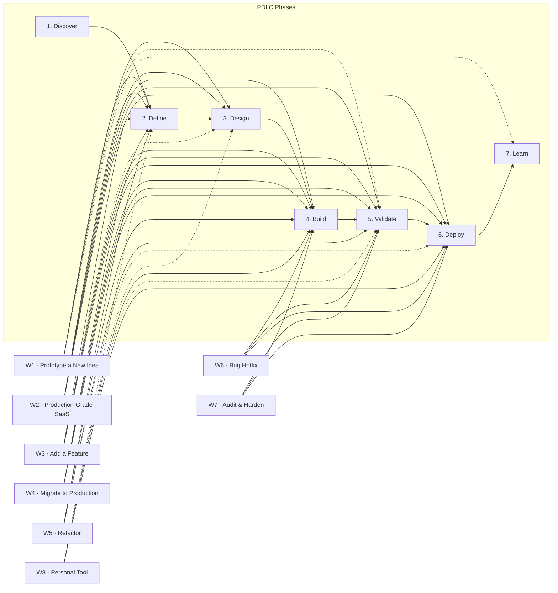

# Workflows

Eight named paths through the [PDLC](PDLC_Phases.md), each composed from the [agents and skills](AGENTS.md) in this repo. They differ in **intent**, **rigor**, and **which phases get the most weight** — not in lifecycle. Every workflow walks the same seven phases (Discover → Define → Design → Build → Validate → Deploy → Learn); the lighter ones spend less time in some and more in others, but they don't *skip* the thinking the lifecycle expects.

For the one-page big-picture view of how phases, skills, and agents connect, see [MAP.md](MAP.md).

---

## How to choose a workflow

Match what you're doing to the **Pick when** column. If two fit, pick the heavier one — easier to skip rigor than to retrofit it.

| # | Workflow | Pick when |
|---|---|---|
| **W1** | [Prototype a New Idea](workflows/W1-prototype-new-idea.md) | You want a clickable mockup in hours to validate a concept. Throwaway. |
| **W2** | [Build a Production-Grade SaaS Product](workflows/W2-production-saas.md) | Validated pain point → real SaaS with auth, payments, monitoring, deploy. |
| **W3** | [Add a Feature to an Existing Product](workflows/W3-add-feature.md) | Backlog feature on a live codebase. Minimal disruption. |
| **W4** | [Migrate a Prototype to Production](workflows/W4-migrate-to-production.md) | Rescue a Replit / V0 / Lovable / Bolt / ChatGPT MVP. |
| **W5** | [Refactor & Modernize an Existing Codebase](workflows/W5-refactor-modernize.md) | Pay down debt, deepen modules — no behavior change. |
| **W6** | [Fix a Production Bug](workflows/W6-fix-production-bug.md) | Customer-reported bug or PagerDuty page. |
| **W7** | [Audit & Harden for Production Launch](workflows/W7-audit-harden.md) | Existing app "works" but hasn't been scrutinized. |
| **W8** | [Build a Personal-Use Tool](workflows/W8-personal-tool.md) | Solo / private tool. No Stripe, no full auth, no Sentry/PostHog. |

---

## Master diagram

All eight workflows mapped onto the seven PDLC phases. Solid arrows = primary flow. Dashed arrows = optional / conditional.

> Mermaid renders inline on GitHub. If you're reading the source, paste the block into [mermaid.live](https://mermaid.live) for an interactive view.

---

## Workflow → skills heatmap

Which skills each workflow touches. **●** = always used. **○** = conditional / optional. Blank = not used.

| Skill | W1 | W2 | W3 | W4 | W5 | W6 | W7 | W8 |
|---|:-:|:-:|:-:|:-:|:-:|:-:|:-:|:-:|
| `/start` | ○ | ● | ○ | ○ | ○ | | | ○ |
| `/next` | | ● | ● | ● | ● | ○ | ● | ○ |
| `/resume` | ○ | ● | ● | ● | ● | ○ | ● | ○ |
| `/workflow` | ○ | ○ | ○ | ○ | ○ | ○ | ○ | ○ |
| `/setup-project` | | ● | | | | | | ● |
| `/discover` | ○ | ● | ○ | | | | | |
| `/prd` | ○ | ● | ● | ○ | | | | ○ |
| `/plan` | ○ | ● | ● | ● | ● | | | ○ |
| `/measure` | | ● | ○ | | | | | |
| `/refactor` | | | ○ | | ● | ○ | ○ | |
| `/glossary` | ○ | ● | ○ | | | | | |
| `/grill-me` | ○ | ● | ○ | | ● | | | |
| `/architect` | | ● | ○ | | | | | |
| `/prototype` | ● | ● | ○ | | | | | ○ |
| `/code-map` | | | ● | ● | ● | ○ | | |
| `/setup-database` | | ● | ○ | ● | | | ○ | ● |
| `/add-auth` | | ● | ○ | ○ | | | ○ | ○ |
| `/add-payment` | | ● | ○ | ○ | | | ○ | |
| `/add-files` | | ● | ○ | ○ | | | ○ | ○ |
| `/add-monitoring` | | ● | ○ | ● | | | ● | |
| `/build-feature` | | ● | ● | ○ | ● | ● | ● | ● |
| `/migrate-from-vibe` | | | | ● | | | | |
| `/triage` | | ● | ● | ● | ● | ● | ● | ○ |
| `/uat` | | ● | ● | ● | ○ | | ○ | |
| `/accessibility` | | ● | ○ | ● | | | ● | |
| `/check-production` | | ● | ● | ● | ● | ● | ● | ○ |
| `/feature-flag` | | ● | ● | ○ | | | | |
| `/rollback` | | ○ | ○ | ○ | | ● | | |
| `/runbook` | | ● | ○ | ● | | | | |
| `/deploy` | ○ | ● | ● | ● | ● | ● | ● | ● |
| `/handoff` | | ● | ○ | ○ | | | | |
| `/post-launch-review` | | ● | ○ | ● | | | | |
| `/postmortem` | | ○ | ○ | | | ○ | ○ | |

---

## Read each workflow

Each workflow has its own page with **when to use**, **PDLC mapping**, **ordered skill sequence**, **flow diagram**, **agents called**, **gaps surfaced**, and an **example walkthrough**:

- [W1 — Prototype a New Idea](workflows/W1-prototype-new-idea.md)
- [W2 — Build a Production-Grade SaaS Product](workflows/W2-production-saas.md)
- [W3 — Add a Feature to an Existing Product](workflows/W3-add-feature.md)
- [W4 — Migrate a Prototype to Production](workflows/W4-migrate-to-production.md)
- [W5 — Refactor & Modernize an Existing Codebase](workflows/W5-refactor-modernize.md)
- [W6 — Fix a Production Bug](workflows/W6-fix-production-bug.md)
- [W7 — Audit & Harden for Production Launch](workflows/W7-audit-harden.md)
- [W8 — Build a Personal-Use Tool](workflows/W8-personal-tool.md)
