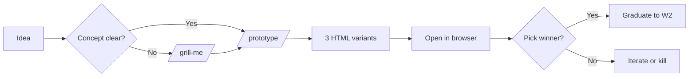

# W1 — Prototype a New Idea

> *"Could this be a thing? Let me see it."*

## When to use

You have an idea. You want to validate the **concept** — flow, value prop, look-and-feel — before investing real engineering. Output is a clickable HTML prototype someone can navigate in a browser, share with a stakeholder, or hand to a designer. **It is throwaway.** No backend. No real auth. Mocked everything.

If a prototype lands well, you graduate to [W2](W2-production-saas.md). If it doesn't, you cost yourself half a day, not half a quarter.

## PDLC mapping

| Phase | Done? | How |
|---|---|---|
| 1 · Discover | ⚠️ Should have happened — even an informal "is this a real pain?" check before prototyping |
| 2 · Define | ☑️ *Light* | A paragraph or two of context; **no PRD** |
| 3 · Design | ☑️ **Core phase** | `/prototype` produces three variants |
| 4 · Build | ⏭️ Skipped | Or hand the HTML to Replit / V0 for an interactive next step |
| 5 · Validate | ☑️ *Human* | Show the variants to users / stakeholders |
| 6 · Deploy | ☑️ *Light* | Share the HTML file, host on GitHub Pages, or open in browser |
| 7 · Learn | ☑️ *Decision gate* | Graduate to W2, iterate on prototype, or kill the idea |

## Skill sequence

1. **(Optional)** `/grill-me` — if the idea is hand-wavy, stress-test it for 5 minutes before prototyping
2. **`/prototype`** — generates `prototypes/variant-A.html`, `variant-B.html`, `variant-C.html` (Tailwind via CDN, mock data, fake auth, fake API)
3. **(Manual)** open each variant in a browser; pick a winner
4. **(Optional)** `/deploy` — only if you want a public URL for the chosen variant

## Diagram

## Agents called

- None directly. `/prototype` is self-contained — no codebase to detect.

## Gaps surfaced

- **No `/discover` skill** to formalize problem framing before prototyping. Currently human-led. → [GAPS.md](../GAPS.md#discover-phase)
- **No `/post-launch-review` skill** to capture prototype feedback structurally. → [GAPS.md](../GAPS.md#learn-phase)

## Example walkthrough

You're chatting with a colleague: "We should have an internal tool that shows everyone's GitHub PR review queue, color-coded by age." Sounds reasonable. Three hours later:

1. You open Claude Code, run `/grill-me` for 10 minutes — discover you actually want **stale PRs only**, sorted by stalest.
2. `/prototype` produces three variants: a kanban-style board, a list with red/yellow/green age dots, a calendar heatmap.
3. You open all three. The kanban feels wrong. The list is the obvious winner. The heatmap is interesting but premature.
4. You share the list HTML in Slack with two engineers. Both say "yes, build this."

Now you can confidently kick off [W2](W2-production-saas.md) (if it warrants production rigor) or [W8](W8-personal-tool.md) (if it's just for your team's eyes).
