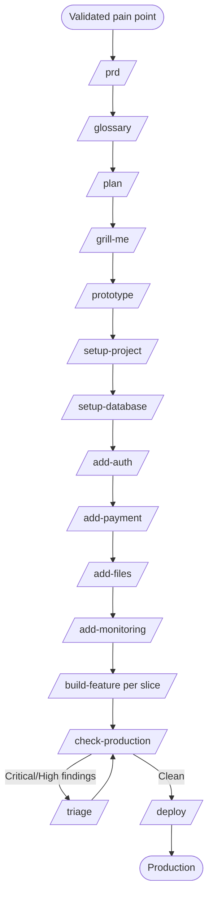

# W2 — Build a Production-Grade SaaS Product

> *"I have a validated pain point. I want to ship a real product."*

## When to use

You've validated the problem (through your own [W1 prototype](W1-prototype-new-idea.md), customer conversations, or prior work). You want to ship a SaaS — real auth, real payments, monitoring, deployed, with paying users in mind. This is the **most rigorous** workflow and uses the most skills.

If you're a solo developer building for yourself with no plans to charge or scale, use [W8](W8-personal-tool.md) instead — it skips everything you don't need.

## PDLC mapping

| Phase | Skills | Why |
|---|---|---|
| 1 · Discover | *(human-led — assumed done before this workflow)* | This workflow assumes a real, validated pain |
| 2 · Define | `/prd` → `/glossary` → `/plan` → `/grill-me` | Synthesize PRD; pin down domain language; break into vertical slices; stress-test |
| 3 · Design | `/prototype` | Three HTML variants → pick one → that's the design reference |
| 4 · Build | `/setup-project` → `/setup-database` → `/add-auth` → `/add-payment` → `/add-files` → `/add-monitoring` → `/build-feature` (per slice) | Disciplined waves, one commit per layer |
| 5 · Validate | `/check-production` → `/triage` (any findings) | Severity-graded audit; bug triage cycle |
| 6 · Deploy | `/deploy` | Pre-flight, env, domain, SSL, smoke tests, runbook |
| 7 · Learn | *(human-led — gap)* | Currently no skill — see [GAPS.md](../GAPS.md#learn-phase) |

## Skill sequence

1. **`/prd`** — synthesize a comprehensive PRD from the conversation
2. **`/glossary`** — pin down domain terms before code disagrees on what they mean
3. **`/plan`** — turn the PRD into vertical slices with TDD strategy each
4. **`/grill-me`** — interrogate the plan; surface unknowns
5. **`/prototype`** — three HTML variants; pick one
6. **`/setup-project`** — scaffold the preferred stack in waves
7. **`/setup-database`** — schema + migrations
8. **`/add-auth`** — Neon Auth via Better Auth (or detected alternative)
9. **`/add-payment`** — Stripe + webhooks + Customer Portal
10. **`/add-files`** — AWS S3 + CloudFront + validation (only if feature needs it)
11. **`/add-monitoring`** — Sentry + PostHog
12. **`/build-feature`** — per slice, TDD layers, one commit per layer
13. **`/check-production`** — full audit before launch
14. **`/triage`** — fix any Critical / High findings
15. **`/deploy`** — go live
16. *(loop)* `/next-steps` between any of the above to stay oriented

## Diagram

## Agents called

Across the workflow, all six agents fire at different points:

- **`stack-detector`** — start of every `/add-*` and `/build-feature` invocation
- **`codebase-classifier`** — by `/next-steps` and `/check-production`
- **`pattern-finder`** — before any new file is written by `/build-feature`, `/add-auth`, `/add-payment`, etc.
- **`secret-scanner`** — by `/check-production` and as a `/deploy` pre-flight gate
- **`dependency-currency-checker`** — by `/next-steps` and `/check-production`
- **`prod-readiness-auditor`** — orchestrated by `/check-production`

## Gaps surfaced

- **No `/add-email`** — Resend integration is currently handled inside `/build-feature`. → [GAPS.md](../GAPS.md#build-phase)
- **No `/add-ai`** — AI features (Anthropic SDK, RAG patterns) are scattered into `/setup-project` Wave 7 instead of a dedicated skill. → [GAPS.md](../GAPS.md#build-phase)
- **No `/setup-ci`** — `/check-production` audits CI but no skill creates it. → [GAPS.md](../GAPS.md#build-phase)
- **No `/setup-tests`** — first-test scaffolding is merged into `/build-feature`; standalone helps retrofits. → [GAPS.md](../GAPS.md#build-phase)
- **No `/post-launch-review`** — Phase 7 (Learn) has no skill. → [GAPS.md](../GAPS.md#learn-phase)
- **No `/runbook`** — `/deploy` produces ad-hoc runbook content; could be its own deliverable. → [GAPS.md](../GAPS.md#deploy-phase)

## Example walkthrough

You're shipping "ReviewQueue" — an internal tool for engineering managers to see stale PRs across their team's repos. You've validated it via [W1](W1-prototype-new-idea.md) with three EMs.

1. **Define (day 1)** — `/prd` produces a 4-page PRD: problem, personas (EM, IC), 12 user stories, success metrics (P50 PR age ↓ 30%, weekly active EMs ≥ 80% of pilot). `/glossary` pins down "stale", "owner", "review", "queue". `/plan` slices into: M1 GitHub OAuth + repo selection. M2 PR list with age. M3 Filtering. M4 Notifications. M5 Billing. `/grill-me` exposes that you haven't decided per-user vs per-org pricing — you decide org-tier.
2. **Design (day 2)** — `/prototype` gives you three variants. You pick a Linear-style sidebar layout.
3. **Build (weeks 1–4)** — `/setup-project` scaffolds Next.js App Router + Drizzle + Neon. `/setup-database` creates `users`, `orgs`, `repos`, `prs` tables. `/add-auth` wires Neon Auth (Better Auth) with GitHub OAuth. `/add-payment` wires Stripe org-tier subscription. `/add-monitoring` wires Sentry + PostHog. Then `/build-feature` for each slice, one commit per TDD layer.
4. **Validate (week 5)** — `/check-production` flags two Highs (no rate limit on `/api/refresh`, missing webhook signature check on Stripe). `/triage` produces fix proposals for both. You apply fixes; re-run `/check-production` — clean.
5. **Deploy (week 5)** — `/deploy` walks Vercel setup, env vars, custom domain `reviewqueue.example.com`, GitHub OAuth callback URL update, Stripe webhook URL update, smoke tests. Live.
6. **Learn (week 6+)** — manual. PostHog dashboards show three EMs onboarded; P50 PR age trending down. You decide to invest in M3 next.
