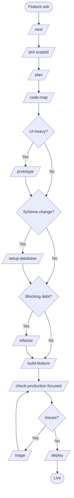

# W3 — Add a Feature to an Existing Product

> *"The product is live. Customers want X. Let's add it without breaking anything."*

## When to use

You have a working production codebase with real users. You're adding a backlog feature, expansion play, or customer ask. The codebase already has its own conventions, auth, schema, deploy pipeline. Your job is to add **without disrupting** what already works.

If the codebase is a chaotic prototype rather than a real product, you're in [W4](W4-migrate-to-production.md) territory first. If you're improving internals without changing behavior, see [W5](W5-refactor-modernize.md).

## PDLC mapping

| Phase | Skills | Why |
|---|---|---|
| 1 · Discover | *(skipped)* | Decision to build is upstream |
| 2 · Define | `/prd` (scoped) → `/plan` | Scoped PRD; one feature, not a product |
| 3 · Design | `/code-map` → `/prototype` (only if UI-heavy) | Understand existing area first |
| 4 · Build | `/build-feature` → `/setup-database` (if schema change) → `/refactor` (if blocking debt) | Mirror existing patterns; tiny commits |
| 5 · Validate | `/check-production` (focused) → `/triage` | Audit only the changed area; fix regressions |
| 6 · Deploy | `/deploy` | Incremental — feature flags if available |
| 7 · Learn | *(human-led)* | Track adoption + impact |

## Skill sequence

1. **`/next`** — see what's been changing, where you're at
2. **`/prd`** — scoped PRD for this feature only
3. **`/plan`** — vertical slices for this feature
4. **`/code-map`** — understand the existing area before touching it
5. *(optional)* **`/prototype`** — only if the feature is UI-heavy and the design is uncertain
6. *(optional)* **`/setup-database`** — if schema changes are needed
7. *(optional)* **`/refactor`** — if there's debt blocking this feature; refactor first, ship the feature on top
8. **`/build-feature`** — implement, one commit per TDD layer, mirroring existing patterns
9. **`/check-production`** — focused audit on the changed area
10. **`/triage`** — fix any regressions
11. **`/deploy`** — incremental rollout

## Diagram

## Agents called

- **`stack-detector`** — confirms the existing stack so the feature stays in style
- **`codebase-classifier`** — should return `wired` (well-wired); if it returns `vibe-coded`, switch to [W4](W4-migrate-to-production.md)
- **`pattern-finder`** — heavily used to mirror existing routes / components / tests
- **`secret-scanner`** + **`dependency-currency-checker`** — invoked by `/check-production`
- **`prod-readiness-auditor`** — focused audit at the end

## Gaps surfaced

- **No `/feature-flag` skill** — staged rollout is currently manual. → [GAPS.md](../GAPS.md#deploy-phase)
- **No `/post-launch-review`** for measuring feature adoption + impact. → [GAPS.md](../GAPS.md#learn-phase)
- **No `/uat` skill** for user acceptance testing the feature with a small cohort before full rollout. → [GAPS.md](../GAPS.md#validate-phase)

## Example walkthrough

The team ships "saved searches" on top of ReviewQueue (built in [W2](W2-production-saas.md)).

1. `/next` confirms the project is on `wired` status, deploys clean, no Critical findings open.
2. `/prd` produces a 1-page scoped PRD: users save filter combinations, get notified when matching PRs appear.
3. `/plan` slices into M1 schema + storage. M2 save/list API. M3 UI in sidebar. M4 notifications via existing webhook plumbing.
4. `/code-map` zooms out on the filtering area: shows `useFilters` hook → `pr-search` storage method → `/api/prs/search` route. Public interface clear; internals hidden.
5. `/setup-database` adds `saved_searches` table — one migration, reviewed, applied.
6. `/build-feature` builds M1–M4. Mirrors existing patterns (`pattern-finder` returns the existing route shape, validation pattern, test pattern). One commit per layer.
7. `/check-production` (focused on the new files) clean.
8. `/deploy` ships behind a PostHog feature flag, rolled out 10% → 50% → 100% over 48 hours.
