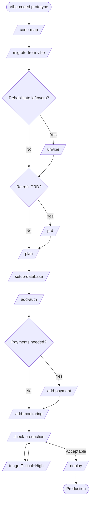

# W4 — Migrate a Prototype to Production

> *"The Replit MVP is getting traction. We can't keep deploying via the Replit button."*

## When to use

You have a working app on a vibe-coding platform (Replit, V0, Lovable, Bolt, Cursor-only, ChatGPT-generated) — or any rapidly-built prototype with inconsistent patterns and missing production basics. People are using it. You can't throw it away. You need to **rescue and harden** it.

This is harder than [W2](W2-production-saas.md) because you're working around existing decisions, not making fresh ones. The rule: **preserve what works. Flag inconsistencies; don't fix them inline.**

## PDLC mapping

| Phase | Skills | Why |
|---|---|---|
| 1 · Discover | *(done — there's already a prototype)* | |
| 2 · Define | `/code-map` → *(optional)* `/prd` retrofit → `/plan` | Understand what's there; document; plan the gap fixes |
| 3 · Design | *(usually skipped)* | Design exists in the working UI |
| 4 · Build | `/migrate-from-vibe` → *(optional)* `/unvibe` → `/setup-database` → `/add-auth` → `/add-payment` (if needed) → `/add-monitoring` | Wave 1: extract. Wave 2: rehabilitate the leftover mess. Then fill gaps. |
| 5 · Validate | `/check-production` (heavy findings expected) → `/triage` | Audit will return many Highs — work through them |
| 6 · Deploy | `/deploy` | First real production deploy |
| 7 · Learn | *(human-led)* | Decide what stayed broken intentionally vs. what to circle back on |

## Skill sequence

1. **`/code-map`** — first pass: what *is* this app? Where does data flow?
2. **`/migrate-from-vibe`** — detects the source platform, extracts the working app, ports to the user's preferred local stack in waves (one commit per wave); flags inconsistencies as out-of-scope
3. *(optional but recommended)* **`/unvibe`** — work through the out-of-scope items from `/migrate-from-vibe`: strip leftover platform artifacts, remove dead code, consolidate duplicates, converge competing patterns, harden production basics. Read-only assess first, then waves of approved changes.
4. *(optional)* **`/prd`** — retrofit a PRD so future work has a north star
5. **`/plan`** — plan the gap fixes (auth missing? monitoring missing? payments wonky?)
6. **`/setup-database`** — bring schema under proper migration control
6. **`/add-auth`** — if auth is fake or hand-rolled
7. **`/add-payment`** — if payments need to be production-real
8. **`/add-monitoring`** — almost always missing in vibe-coded apps
9. **`/check-production`** — full audit; expect many findings
10. **`/triage`** — work the findings list. Fix Critical/High. Park or document Medium/Low.
11. **`/deploy`** — first real deploy to production hosting
12. **`/next-steps`** — keeps you oriented as the file count grows

## Diagram

## Agents called

- **`stack-detector`** — early, to know what's there
- **`codebase-classifier`** — should return `vibe-coded`; that classification flips many skills into "extend, don't migrate" mode per `_adaptation-playbook.md`
- **`pattern-finder`** — used heavily to *describe* the chaotic patterns rather than mirror them (so the user understands what they're inheriting)
- **`secret-scanner`** — vibe-coded apps frequently contain committed `.env` or hard-coded keys
- **`dependency-currency-checker`** — catches old dependencies that the platform was holding back
- **`prod-readiness-auditor`** — the final big audit
- **`vibe-artifact-detector`**, **`duplication-detector`**, **`dead-code-detector`**, **`architecture-drift-detector`** — the four read-only detectors `/unvibe` orchestrates to surface what to clean up

## Gaps surfaced

- **No `/discover` skill** to retroactively validate whether the prototype's traction is real before investing the migration effort. → [GAPS.md](../GAPS.md#discover-phase)
- **No `/uat`** — vibe-coded apps benefit hugely from a structured UAT pass with the early users to confirm what behavior must be preserved. → [GAPS.md](../GAPS.md#validate-phase)
- **No `/runbook`** — first-real-deploy is the right time to write the first runbook. → [GAPS.md](../GAPS.md#deploy-phase)

## Example walkthrough

A founder has built "InvoiceParse" on Replit using ChatGPT. Two real customers are paying via a hard-coded Stripe checkout link. The Replit container restarted last week and lost data. They need out.

1. **`/code-map`** — the app is one big `index.ts` with everything in it: file upload to a Replit volume, OCR via Tesseract, hard-coded Stripe checkout, passwords stored in plaintext.
2. **`/migrate-from-vibe`** — detects Replit. Walks the founder through extracting the code, scaffolding a real Vite + Hono + Neon repo, porting in waves: Wave 1 backend routes. Wave 2 file upload. Wave 3 OCR. Wave 4 payment. Wave 5 frontend. One commit per wave. Inconsistencies (e.g. mixed JSON-vs-form-encoded request handling) are flagged in `MIGRATION-NOTES.md` rather than fixed mid-port.
3. **`/setup-database`** — proper Drizzle schema, migration history starts here.
4. **`/add-auth`** — Neon Auth via Better Auth. Existing two users invited via email; passwords reset.
5. **`/add-payment`** — proper Stripe Checkout sessions, webhook with signature verification, replaces hard-coded link.
6. **`/add-monitoring`** — Sentry catches an immediate stack trace from a malformed PDF. PostHog tracks usage.
7. **`/check-production`** — returns 1 Critical (`.env` was committed in Wave 1; needs scrub from git history), 4 Highs (no rate limit, no input size limit on uploads, no idempotency on webhook, no email validation on signup), 6 Mediums.
8. **`/triage`** — fixes Critical (`git filter-repo`, rotate keys via secret-scanner's rotation actions). Fixes 4 Highs. Parks Mediums in a backlog.
9. **`/deploy`** — Vercel or Railway (the founder's choice) + custom domain. First time the app has a real URL.
10. The two existing users are migrated. App now survives container restarts. The founder breathes.
