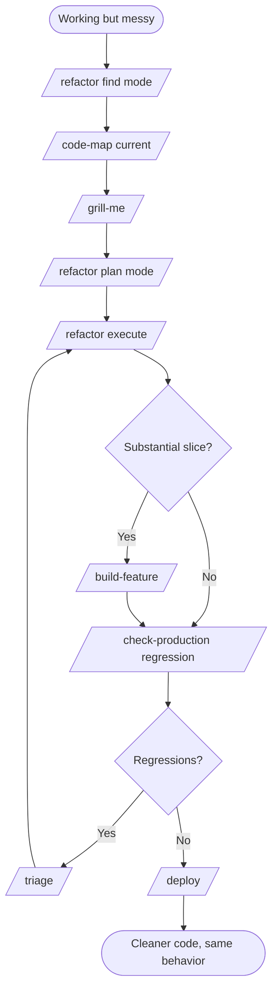

# W5 — Refactor & Modernize an Existing Codebase

> *"It works. It's just hard to work with."*

## When to use

You have a working codebase but the internals have grown shallow, repetitive, hard to test, hard to navigate. You want to **improve the inside without changing the outside.** Maybe you're prepping for a major feature; maybe your AI tools are getting confused by the file layout; maybe you're paying down debt before scaling the team.

If the goal is a behavior change, this is [W3](W3-add-feature.md). If the codebase is genuinely vibe-coded chaos, run [W4](W4-migrate-to-production.md) first to get to a stable baseline.

## PDLC mapping

| Phase | Skills | Why |
|---|---|---|
| 1 · Discover | *(skipped)* | Decision is internal |
| 2 · Define | `/refactor` (find mode) → `/grill-me` → `/refactor` (plan mode) | Find opportunities; stress-test the plan |
| 3 · Design | `/code-map` | Establish the current architecture before changing it |
| 4 · Build | `/refactor` (execute) → `/build-feature` (per refactored slice) | Tiny commits; mirror existing patterns inside the new shape |
| 5 · Validate | `/check-production` (regression sanity) → `/triage` | Make sure nothing broke |
| 6 · Deploy | `/deploy` | Often deploy mid-refactor for safety |
| 7 · Learn | *(human-led)* | Track if the refactor delivered the leverage you expected |

## Skill sequence

1. **`/refactor` — find mode** — scan for shallow modules, missing seams, AI-confusion hotspots
2. **`/code-map`** — current architecture map (before)
3. **`/grill-me`** — stress-test the proposed direction
4. **`/refactor` — plan mode** — produce `.claude/refactor-plan.md` with tiny ordered commits
5. **`/refactor` — execute** — work the plan one commit at a time
6. *(optional)* **`/build-feature`** — for any slice that's substantial enough to warrant TDD layers
7. **`/check-production`** — regression sanity check (was anything accidentally broken?)
8. **`/triage`** — fix any regressions
9. **`/deploy`** — incremental deploys are fine — refactors are safest in small live chunks

## Diagram

## Agents called

- **`stack-detector`** — confirms current stack
- **`codebase-classifier`** — should return `wired`; if `vibe-coded`, run [W4](W4-migrate-to-production.md) first
- **`pattern-finder`** — finds existing shapes so the refactor stays consistent
- **`prod-readiness-auditor`** — invoked by `/check-production` for the regression sanity pass

## Gaps surfaced

- **No `/load-test` skill** — refactors that improve performance benefit from a before/after benchmark. → [GAPS.md](../GAPS.md#validate-phase)
- **No structured `/runbook` update** when a refactor changes operational behavior. → [GAPS.md](../GAPS.md#deploy-phase)

## Example walkthrough

ReviewQueue's `pr-search` storage method has grown to 600 lines, hand-rolled SQL, six callers that each duplicate the same ranking logic.

1. **`/refactor` find mode** — surfaces this exact module as the deepest opportunity. Also flags two smaller ones.
2. **`/code-map`** — shows six callers, each constructing the same query fragments differently. Public interface: `searchPRs(filters)`. Internal: a tangle.
3. **`/grill-me`** — interrogates: *Should ranking be a separate module? What about caching? Are any callers relying on the current ordering?* You decide ranking → its own deep module; caching → next sprint; no caller depends on undefined ordering.
4. **`/refactor` plan mode** — produces a 9-commit plan: extract types, extract ranking, replace caller 1, … replace caller 6, delete dead code, update docs.
5. **`/refactor` execute** — commits land one at a time. Each commit is small enough to read and revert.
6. **`/check-production`** — clean. No regressions.
7. **`/deploy`** — deploys incrementally as commits land. By the end of the week, `pr-search` is 180 lines, ranking is a 90-line testable module, callers all share one path.
