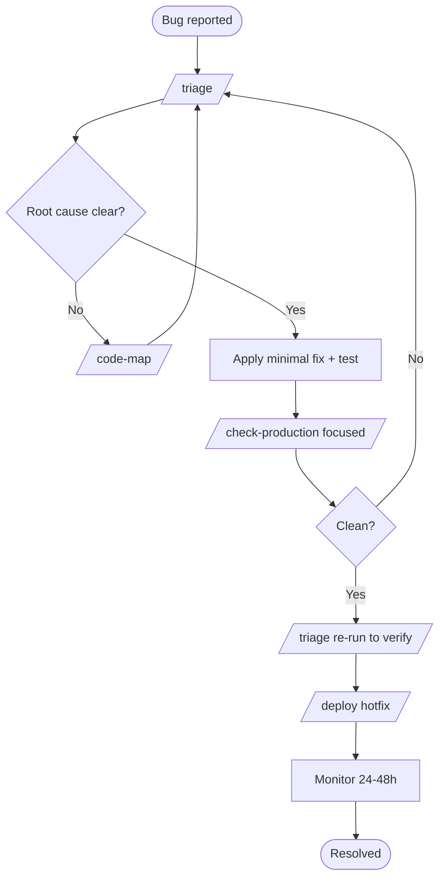

# W6 — Fix a Production Bug

> *"Customer says X is broken. Confirm. Fix. Ship."*

## When to use

You have a bug. Probably a customer reported it, or PagerDuty paged, or you spotted it in Sentry. You want to **understand the root cause, fix it, ship the fix, and verify** — without scope-creeping into a refactor or a re-architecture.

This is the lightest workflow in the library. It's a focused triage → fix → deploy loop.

## PDLC mapping

| Phase | Skills | Why |
|---|---|---|
| 1 · Discover | *(skipped)* | The issue is the spec |
| 2 · Define | *(skipped)* | `/triage` produces the bug report — that's enough |
| 3 · Design | *(skipped)* | Unless the fix is non-trivial |
| 4 · Build | `/triage` → minimal fix → *(optional)* `/code-map` | Find root cause; smallest correct fix |
| 5 · Validate | `/check-production` (focused) → re-run `/triage` to confirm | Verify the fix; don't introduce regressions |
| 6 · Deploy | `/deploy` (hotfix path) | Ship; monitor in real time |
| 7 · Learn | *(human-led postmortem)* | If the bug was severe, postmortem |

## Skill sequence

1. **`/triage`** — listen, investigate, find root cause, propose 2+ fixes (root + workaround), write `.claude/bugs/<name>.md`
2. *(optional)* **`/code-map`** — only if context is unclear before fixing
3. **Apply the fix** — smallest possible change, with a test that fails before / passes after
4. **`/check-production`** *(focused on the changed area)* — sanity check
5. **`/triage`** *(re-run as a verification step on the same bug entry)* — confirms the issue is resolved
6. **`/deploy`** — hotfix path, with rollback plan
7. **(human)** monitor Sentry / PostHog dashboards for 24–48 hours

## Diagram

## Agents called

- **`stack-detector`** — invoked by triage if the file involved is in an unfamiliar area
- **`pattern-finder`** — when the fix needs a new helper that should match local style
- **`prod-readiness-auditor`** — on the focused `/check-production`
- **`secret-scanner`** — only if the fix touches anything credentials-adjacent (rare)

## Gaps surfaced

- **No `/rollback` skill** — when the hotfix itself is the rollback condition, there's no codified playbook. → [GAPS.md](../GAPS.md#deploy-phase)
- **No `/postmortem` skill** — for severe bugs, a structured postmortem is currently manual. → [GAPS.md](../GAPS.md#learn-phase)

## Example walkthrough

A customer reports: "Stripe webhook fired but my subscription didn't activate."

1. **`/triage`** — listens. Asks for the customer ID, the timestamp, the exact symptom. Pulls Sentry events, grep server logs, traces the webhook handler. Hypothesis: the handler runs `await db.user.update(...)` inside a `try` that catches and silently logs, so a transient DB connection error swallowed the update. Two proposed fixes: (a) **root cause** — replace silent-catch with explicit error + retry queue, (b) **workaround** — manual SQL update for this customer now, fix root after.
2. You agree to do (b) immediately and (a) properly.
3. Manual SQL fixes the customer — they confirm.
4. You apply fix (a): explicit error + retry-with-backoff via existing `BullMQ` worker. Test added.
5. **`/check-production`** focused on the webhook area — clean.
6. **`/triage`** re-run on the bug file — verifies the fix.
7. **`/deploy`** — hotfix path, monitored. No further customer reports. Sentry shows the new error path firing 0 times in 48 hours (because no transient failure has happened) — but the test path is exercised in CI.
