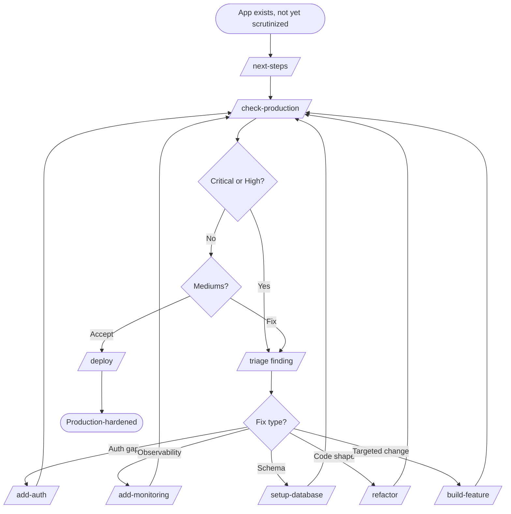

# W7 — Audit & Harden for Production Launch

> *"It works. But is it actually shippable?"*

## When to use

You have an existing app — usually built by humans, sometimes the output of [W4](W4-migrate-to-production.md) — that mostly works but has never been scrutinized at production-readiness rigor. Auth might be ad hoc. Monitoring might be missing. Secrets might be checked in. Dependencies might be a year old. You want a **single audit** to drive **prioritized fixes**, then ship.

The audit drives everything. You don't pre-decide what to fix; you let the audit tell you.

## PDLC mapping

| Phase | Skills | Why |
|---|---|---|
| 1 · Discover | *(skipped)* | App exists |
| 2 · Define | *(skipped)* | Audit findings are the spec |
| 3 · Design | *(skipped)* | No new features |
| 4 · Build | Driven by audit findings — typically `/add-auth`, `/add-monitoring`, `/setup-database` migrations, `/refactor` for hot spots | Fix what the audit flagged, in severity order |
| 5 · Validate | **`/check-production` first (it drives everything)** → `/triage` per finding → re-run `/check-production` to confirm | The audit IS the workflow |
| 6 · Deploy | `/deploy` | Once Critical / High are clean |
| 7 · Learn | *(human-led)* | Track time-to-fix and recurrence |

## Skill sequence

1. **`/next-steps`** — orient: what's the current state?
2. **`/check-production`** — full audit. **This is the driving artifact.** Returns Critical / High / Medium / Low findings with `file:line` citations and recommended fix order.
3. **For each Critical / High finding (in order):**
   - **`/triage`** — investigate, propose fixes, write bug report
   - Apply fix (often via a `/build-feature` slice or `/refactor` mini-plan)
   - Sometimes invoke a Build skill: `/add-auth` if auth was the gap, `/add-monitoring` if observability was, `/setup-database` for schema fixes
4. **Re-run `/check-production`** — confirm Criticals / Highs are clean
5. **Decide on Mediums** — fix or document as accepted risk
6. **`/deploy`** — once you're satisfied with the audit posture

## Diagram

## Agents called

This is the agent-heaviest workflow. `/check-production` orchestrates parallel runs of all six:

- **`stack-detector`** — what stack are we hardening?
- **`codebase-classifier`** — wired vs vibe-coded shapes the recommendation tone
- **`secret-scanner`** — almost always finds something on first run
- **`dependency-currency-checker`** — old deps are a top source of CVEs
- **`pattern-finder`** — when fixes need new files, mirror existing style
- **`prod-readiness-auditor`** — the deep 9-area audit itself

## Gaps surfaced

- **No `/accessibility` audit skill** — `/check-production` covers a lot, but accessibility is currently outside its scope. → [GAPS.md](../GAPS.md#validate-phase)
- **No `/load-test` skill** — production-readiness without a load test is partial. → [GAPS.md](../GAPS.md#validate-phase)
- **No `/runbook` generation skill** — hardening typically uncovers operational gaps that should land in a runbook. → [GAPS.md](../GAPS.md#deploy-phase)

## Example walkthrough

You inherit "FormCraft" — built by a contractor, in production for 8 months, no one has touched it in 4. Your team is taking it over.

1. **`/next-steps`** says: codebase classified `wired` but with significant dependency drift; `_stack-preferences.md` differs in 3 places; no Sentry detected.
2. **`/check-production`** returns: **2 Critical** (`.env.production` checked into the repo months ago; webhook secret not verified). **5 High** (rate-limit missing on auth endpoints; unscoped CORS; 14-month-old Next.js major; no Sentry; admin endpoint reachable without RBAC). **8 Medium**. **11 Low**.
3. **Crit #1** (`.env`): `/triage` writes the bug report. You rotate every credential surfaced by `secret-scanner`, `git filter-repo` the file out of history, force-push (with team coordination). Re-run `secret-scanner` — clean.
4. **Crit #2** (webhook): `/triage` → `/build-feature` mini-slice adds signature verification + idempotency.
5. **High: no Sentry** → `/add-monitoring` wires Sentry + PostHog from scratch.
6. **High: stale Next.js** → `/refactor` plan-mode creates a sequenced upgrade plan; execute in tiny commits.
7. **Other Highs** addressed via targeted `/build-feature` slices.
8. **Re-run `/check-production`** — Criticals clean, Highs clean, 6 Mediums remaining (you accept 4, fix 2, document the 4).
9. **`/deploy`** — first deploy under your team's ownership. Domain, SSL, runbook all updated.
