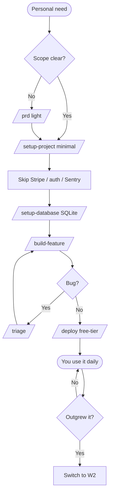

# W8 — Build a Personal-Use Tool

> *"It's just for me. I don't need Stripe."*

## When to use

You're building something for **yourself** — or a tiny private group (your team, your family). No paying users. No multi-tenant requirements. No SLA. You want it to work, look reasonable, run somewhere, and stop demanding your attention. **You're paying with your own time, not your company's runway** — so most of the SaaS-grade rigor in [W2](W2-production-saas.md) is overkill.

This workflow strips out anything you don't need: no Stripe, no full Firebase Auth (often just a single shared password or none), no Sentry/PostHog overhead, often SQLite over Postgres, free-tier deploy.

## PDLC mapping

| Phase | Skills | Why |
|---|---|---|
| 1 · Discover | *(self — you ARE the user)* | |
| 2 · Define | *(very light)* `/prd` (optional) → `/plan` (optional) | Sometimes a 5-minute chat is enough |
| 3 · Design | *(optional)* `/prototype` | Only if UI matters |
| 4 · Build | *(slim)* `/setup-project` (skip Stripe, optionally skip auth) → `/setup-database` (often SQLite) → `/build-feature` | Skip everything you don't need |
| 5 · Validate | `/triage` (debugging) | `/check-production` is overkill — skip or run lightly |
| 6 · Deploy | `/deploy` | Free-tier Render / Cloudflare Pages / Fly / self-hosted |
| 7 · Learn | *(self — you ARE the user)* | |

## Skills you skip (and why)

| Skill | Why skip |
|---|---|
| `/add-payment` | No paying users |
| `/add-monitoring` | Sentry + PostHog free tiers exist, but for a personal tool, errors visible in `console.log` are fine |
| `/add-files` (Firebase) | Often local disk or simple object storage is enough |
| `/add-auth` (full) | Often a shared env-var password or none at all |
| `/glossary` | Vocabulary lives in your head |
| `/grill-me` | You're already aligned with yourself |
| `/check-production` (full audit) | Critical/High findings on a personal tool usually aren't critical to *you* |

## Skill sequence

1. *(optional)* **`/prd`** — only if the scope is fuzzy
2. **`/setup-project`** — *with the SaaS waves you don't need disabled by hand*: skip Stripe, often skip auth, often pick SQLite over Neon. **(See [GAPS.md](../GAPS.md#build-phase) — there's no formal "personal" profile yet; this currently requires telling the skill what to skip.)**
3. **`/setup-database`** — usually SQLite or Postgres-on-fly free tier
4. **`/build-feature`** — TDD layers, but you can be looser on test coverage if it's truly solo
5. *(if a bug appears)* **`/triage`** — still useful even alone
6. **`/deploy`** — to free-tier hosting
7. *(occasionally)* **`/refactor`** — when your personal tool grows beyond what you can hold in your head

## Diagram

## Agents called

- **`stack-detector`** — used by setup
- **`pattern-finder`** — used by build feature
- **`secret-scanner`** — even personal tools benefit; if you accidentally commit a Personal Access Token, it's still bad
- *(skipped)* **`prod-readiness-auditor`** — too heavy for this use case
- *(skipped)* **`dependency-currency-checker`** — re-enable if the tool starts being depended on by anyone else

## Gaps surfaced

- **No `personal` profile branch in `/setup-project`** — currently the skill assumes a SaaS profile. Adapting requires telling the skill which waves to skip mid-conversation. → [GAPS.md](../GAPS.md#build-phase)
- **No `/setup-tests` standalone skill** — for personal tools, scaffolding minimal tests separately from `/build-feature` would help. → [GAPS.md](../GAPS.md#build-phase)
- **`/check-production` has no "lite mode"** — runs as a heavyweight audit even when you just want a 30-second sanity check. → [GAPS.md](../GAPS.md#validate-phase)

## Example walkthrough

You build "MealLog" — a private tool for tracking what you eat with photo + 3-tag entries.

1. **30-second scope chat with Claude** — no `/prd`. You know what you want.
2. **`/setup-project`** — when prompted for waves, you say: "skip Stripe, skip Firebase Auth (use a single env-var password), use SQLite via `better-sqlite3`, skip Sentry." Five waves total instead of nine.
3. **`/setup-database`** — `meals` table with `id`, `created_at`, `photo_path`, `tags`, `note`.
4. **`/build-feature`** — schema → storage → routes → React form. One commit per layer.
5. **`/deploy`** — to Cloudflare Pages + Fly. Single env-var password gates the app. Disk volume for photo uploads.
6. You use it for six months. Once, you accidentally write a bug that double-saves entries — `/triage` finds the duplicate insert in 3 minutes.
7. After six months, friend asks "can I use this too?" You decide whether to graduate to [W2](W2-production-saas.md). Often the answer is no — they get a copy of your repo and run their own.
